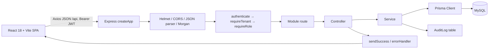
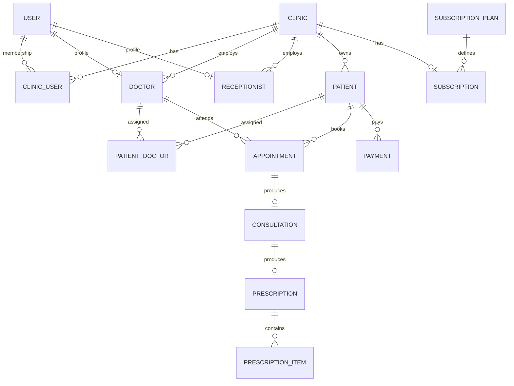
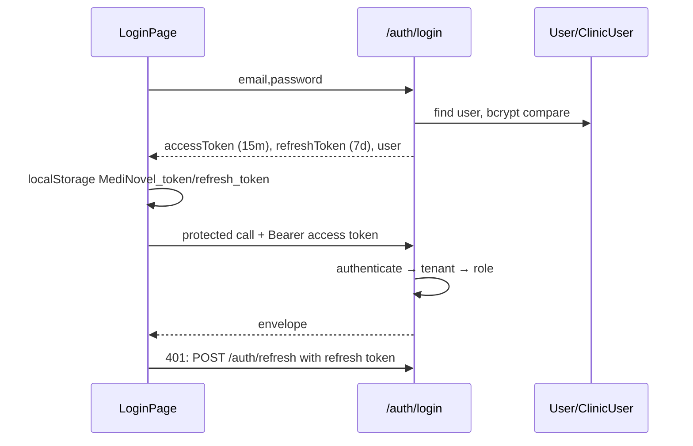
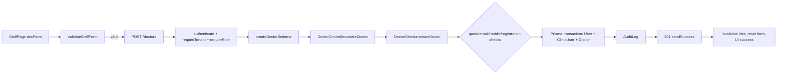

# Project Architecture

**Audit scope:** source inspection only, performed 2026-09-18. No runtime data, secrets, or code were changed by this audit. Paths below are repository-relative. Facts marked **runtime verification required** cannot be proven from source alone.

MediNovel is a multi-tenant clinic-management web application. It is a React single-page application (SPA) that calls an Express JSON API under `/api`; the API uses Prisma directly to persist to MySQL. Tenancy is represented by `Clinic` and enforced on tenant routes by middleware and service query filters.



## Technology Stack

| Area | Actual implementation/evidence |
|---|---|
| Frontend | React 18, TypeScript, Vite, React Router 6; `frontend/package.json`, `frontend/src/main.tsx` |
| UI/state | Tailwind CSS, custom UI components, TanStack React Query, React Context (`AuthContext`) |
| Forms | Controlled React state; `react-hook-form` and Zod packages are installed, but the inspected feature forms use controlled state rather than RHF |
| HTTP | Axios (`frontend/src/api/client.ts`), base URL `VITE_API_URL` or `/api` |
| Backend | Node.js, TypeScript, Express 4; `backend/src/index.ts`, `backend/src/app.ts` |
| ORM/database | Prisma Client 5, datasource provider `mysql`; `backend/prisma/schema.prisma` |
| Auth | JWT access/refresh tokens, bcryptjs password hashes |
| Validation | Zod request schemas via `validateRequest` |
| Logging | Morgan outside test; `console.error` structured API errors; audit records written to `audit_logs` |
| Deployment | Root and frontend `vercel.json`; serverless adapter `api/index.ts` exports `createApp()` |
| Tests | Vitest API/unit tests under `backend/src/tests`; frontend has Vitest tooling but no test files were found by the file inventory |

## Folder Structure

```text
frontend/src/
  api/client.ts, api/errors.ts       Axios and UI error conversion
  context/AuthContext.tsx            session state/token persistence
  routes/AppRoutes.tsx               page routing/role guards
  features/<domain>/*.tsx            pages and feature-local API calls
  components/ui, components/layout   reusable controls/layout
backend/src/
  app.ts, index.ts                   API composition and standalone entry
  modules/<domain>/                  routes → controller → service → schema
  middlewares/                       auth, RBAC, tenant, validation, error, audit
  lib/prisma.ts                      Prisma singleton
  utils/                             JWT, password, response, time helpers
backend/prisma/
  schema.prisma, schema.mysql.prisma database schema; seed.ts demo seed
api/index.ts                         Vercel adapter
```

There is no repository/data-access layer or DTO class layer. Services call `prisma` directly; Zod schemas are the request DTO/validation boundary.

# Application Flow

Every tenant operation follows: **page/component → Axios `apiClient` → Express route → `authenticate` → `requireTenant` → optional `requireRole` / Zod validator → controller → service → Prisma → MySQL → `sendSuccess` envelope → React Query mutation/query/UI**. `apiClient` adds `Authorization: Bearer <MediNovel_token>` and tries `/auth/refresh` once on a 401.

| Feature | Frontend source/action | Backend path | Persistence/response |
|---|---|---|---|
| Sign-in/session | `LoginPage` → `AuthContext.login`; initial `/auth/me` in `AuthContext` | Auth route/controller/service | `User`, `ClinicUser`, optional `Doctor`/`Receptionist`; JWT pair + user profile |
| Password reset/change | `PasswordResetPage` | Auth routes/service | `User.passwordReset*` or `passwordHash`; audit log for reset/verified change |
| Clinics/subscriptions | Super-admin pages; `ClinicSettingsPage` | super-admin, clinics, subscriptions modules | `Clinic`, `SubscriptionPlan`, `Subscription`, staff/user transaction |
| Doctor/staff | `StaffPage` | doctors/receptionists modules | Transaction creates `User`, `ClinicUser`, profile; audit log |
| Patients | `PatientsPage`, `PatientProfilePage`, appointment quick-create | patients module | `Patient`, `PatientDoctor`; duplicate check is query-only |
| Appointments/queue | `AppointmentsPage`, queue and dashboards | appointments then queue module | `Appointment` status/token transitions; audit log |
| Consultation/Rx | `ConsultationRoomPage`, `PrescriptionsPage` | consultations/prescriptions | `Consultation`, optional `Prescription`/items, follow-up appointment |
| Billing | `BillingPage`, consultation page | payments module | `Payment`, `PaymentReceipt`; transactional totals/status |
| Admissions | `AdmissionsPage` | admissions module | `Admission`, `AdmissionPayment` |
| Reports | doctor/reception dashboards, reports page | reports module | aggregate Prisma reads |
| Contact | landing page demo form | public contact module | `Inquiry` |

# Frontend Architecture

Pages are feature-local and call Axios directly, generally inside React Query `useQuery`/`useMutation`; there is no generated SDK. `AppRoutes.tsx` uses `RoleGuard` for `SUPER_ADMIN`, `DOCTOR`, and `RECEPTIONIST` routes. Shared `Input`, `Select`, and `Textarea` render error text near a field. Navigation/layout is in `components/layout`.

**Frontend-to-API mapping (observed calls):**

| Page | Action | API |
|---|---|---|
| LoginPage/AuthContext | login, profile, logout | POST `/auth/login`; GET `/auth/me`; POST `/auth/logout` |
| PasswordResetPage | verify and change password | POST `/auth/verify-and-change-password` |
| StaffPage | list/create/delete doctors and receptionists | GET/POST/DELETE `/doctors`; GET/POST/DELETE `/receptionists` |
| PatientsPage/Profile | search/duplicate/create/detail/history/payments/open consult | `/patients*`, `/consultations`, `/payments`, `/consultations/open` |
| AppointmentsPage | list/create/update appointment; quick patient | `/appointments*`, `/patients*`, `/doctors` |
| QueuePage/Dashboards | queue reads and send/start/skip/no-show/cancel | `/queue*`, `/reports/*` |
| ConsultationRoomPage | appointment/consultation save, payment | `/appointments/:id`, `/consultations*`, `/payments` |
| BillingPage | payment list/create | `/payments`, `/appointments` |
| AdmissionsPage | list/admit/pay/discharge | `/admissions*`, `/patients`, `/doctors` |
| ClinicSettingsPage | profile/subscription | GET/PATCH `/clinics/profile`; GET `/subscriptions/current` |
| SuperAdmin pages | dashboard/plans/clinic CRUD/status | `/super-admin/*` |

Backend endpoints without an observed frontend call include: `/health`, `/auth/forgot-password`, `/auth/reset-password`, `/auth/refresh` (called by interceptor rather than a page), `/auth/change-password`, doctor/receptionist PATCHes, patient assignment/removal, appointment cancel shortcut, queue check-in/complete, consultation get-by-id/get-by-appointment, prescription get-by-id, payment PATCH/receipt, and admission PATCH. This means “unused” is source-observed, not proof of external-client non-use.

# Backend Architecture

`createApp()` mounts all routes in `backend/src/app.ts`; the 404 handler precedes the centralized `errorHandler`. Middleware order is Helmet → permissive CORS callback → JSON/urlencoded parsers → cookies → Morgan (not test) → routes. Controllers translate request data to services and call `sendSuccess`; services own business rules and Prisma transactions. `validateRequest` overwrites request body/query/params with parsed Zod values. Errors become `{success:false,error:{code,message,details?}}`.

# Database Architecture

MySQL is configured through `DATABASE_URL`; Prisma maps all models to snake_case tables. IDs are UUID strings. Key relationships:



Models: `User`, `Clinic`, `ClinicUser`, `Doctor`, `Receptionist`, `Patient`, `PatientDoctor`, `Appointment`, `Consultation`, `Prescription`, `PrescriptionItem`, `Payment`, `PaymentReceipt`, `Admission`, `AdmissionPayment`, `SubscriptionPlan`, `Subscription`, `SubscriptionPayment`, `AuditLog`, `Inquiry`. Schema evidence defines uniques including `User.email`, `Clinic.slug`, `Doctor.userId`, `Patient(clinicId,patientNumber)`, `PatientDoctor(patientId,doctorId)`, `Consultation.appointmentId`, `Prescription.consultationId`, `Admission(clinicId,admissionNumber)`, and `Subscription.clinicId`; it also defines tenant/query indexes (see `schema.prisma`). Prisma migrations directory was not found; schema push/migrate scripts exist. `seed.ts` is destructive by design (`deleteMany`) and includes demo credentials—do not run outside an approved demo environment.

# Authentication & Authorization



`AuthService.login` signs tokens in `utils/jwt.ts`, stores only a bcrypt hash of the refresh token, and returns both. The access token is stored in localStorage and inserted by Axios. The interceptor serializes refresh attempts; a failed refresh clears storage and redirects `/login`. `authenticate` fetches the user and first `ClinicUser`, rejects missing/invalid tokens (401), missing/inactive users (401/403), and sets `req.user`/`req.tenant`. Roles are exactly `SUPER_ADMIN`, `DOCTOR`, `RECEPTIONIST`; `requireRole` enforces route roles. Logout clears the server refresh hash and client tokens, although the frontend deliberately suppresses a logout network error.

# Complete API Inventory

All paths below are mounted in `backend/src/app.ts`; `<BASE_URL>` is environment/deployment specific. **Auth** means `Authorization: Bearer <TOKEN>`; **Tenant** additionally means the authenticated user must have a clinic membership; role restrictions are shown.

| Method | Endpoint | Purpose | Access | Request / query (schema source) | Response source |
|---|---|---|---|---|---|
| GET | `/api/health` | DB health | Public | — | inline health route |
| POST | `/api/contact` | submit inquiry | Public | `name,phone,clinicType,city` | ContactController |
| POST | `/api/auth/login` | login | Public | `email,password` | AuthController |
| POST | `/api/auth/forgot-password` | issue reset token/link | Public | `email` | AuthController |
| POST | `/api/auth/reset-password` | reset password | Public | `token,newPassword` | AuthController |
| POST | `/api/auth/refresh` | rotate token pair | Public | `refreshToken` | AuthController |
| POST | `/api/auth/logout` | invalidate refresh token | Auth | — | AuthController |
| GET | `/api/auth/me` | profile | Auth | — | AuthController |
| POST | `/api/auth/change-password` | password change | Auth | `currentPassword,newPassword` | AuthController |
| POST | `/api/auth/verify-and-change-password` | credential-verified password change | Public | `email,mobile,oldPassword,newPassword` | AuthController |
| GET | `/api/super-admin/dashboard` | platform KPIs | Auth, SUPER_ADMIN | — | SuperAdminController |
| GET | `/api/super-admin/clinics` | paged clinics | Auth, SUPER_ADMIN | `page,limit,search,status` query (controller) | SuperAdminController |
| POST | `/api/super-admin/clinics` | create tenant | Auth, SUPER_ADMIN | clinic schema | SuperAdminController |
| PATCH | `/api/super-admin/clinics/:id` | update clinic | Auth, SUPER_ADMIN | update clinic schema | SuperAdminController |
| PATCH | `/api/super-admin/clinics/:id/status` | change clinic status | Auth, SUPER_ADMIN | `{status}` | SuperAdminController |
| GET | `/api/super-admin/plans` | subscription plans | Auth, SUPER_ADMIN | — | SuperAdminController |
| GET/PATCH | `/api/clinics/profile` | get/update own clinic | Tenant; PATCH DOCTOR | update profile schema for PATCH | ClinicController |
| GET | `/api/subscriptions/current` | own subscription | Tenant | — | inline route |
| GET/POST | `/api/doctors` | list/create doctor | Tenant; POST DOCTOR or RECEPTIONIST | doctor create schema | DoctorController |
| PATCH/DELETE | `/api/doctors/:id` | update/delete doctor | Tenant, DOCTOR | update schema for PATCH | DoctorController |
| GET/POST | `/api/receptionists` | list/create receptionist | Tenant; POST DOCTOR | receptionist create schema | ReceptionistController |
| PATCH/DELETE | `/api/receptionists/:id` | update/delete receptionist | Tenant, DOCTOR | update schema for PATCH | ReceptionistController |
| GET | `/api/patients` | paged list | Tenant | `page,limit,search,doctorId` | PatientController |
| GET | `/api/patients/check-duplicate` | candidate duplicates | Tenant | `mobile,patientNumber,fullName` | PatientController |
| POST | `/api/patients` | create patient | Tenant | patient create schema | PatientController |
| GET/PATCH | `/api/patients/:id` | read/update patient | Tenant | patient update schema PATCH | PatientController |
| POST | `/api/patients/:id/doctors` | assign doctor | Tenant, DOCTOR | `{doctorId}` | PatientController |
| DELETE | `/api/patients/:id/doctors/:doctorId` | unassign doctor | Tenant, DOCTOR | — | PatientController |
| GET/POST | `/api/appointments` | list/create | Tenant | list query; create schema | AppointmentController |
| GET | `/api/appointments/:id` | detail | Tenant | — | AppointmentController |
| PATCH | `/api/appointments/:id` | update | Tenant | update schema | AppointmentController |
| PATCH | `/api/appointments/:id/cancel` | cancel | Tenant | — | AppointmentController |
| GET | `/api/queue` | live queue | Tenant | `doctorId,date` (controller) | QueueController |
| POST | `/api/queue/check-in` | check in appointment | Tenant, RECEPTIONIST | controller reads `appointmentId` | QueueController |
| POST | `/api/queue/:id/send|cancel` | receptionist transition | Tenant, RECEPTIONIST | — | QueueController |
| POST | `/api/queue/:id/start|complete|skip|no-show` | doctor transition | Tenant, DOCTOR | — | QueueController |
| GET | `/api/consultations` | list | Tenant | `appointmentId,patientId` | ConsultationController |
| GET | `/api/consultations/appointment/:appointmentId` | by appointment | Tenant | — | ConsultationController |
| GET | `/api/consultations/:id` | detail | Tenant | — | ConsultationController |
| POST | `/api/consultations/open` | open visit | Tenant, DOCTOR | open schema | ConsultationController |
| POST | `/api/consultations` | record visit | Tenant, DOCTOR | create schema | ConsultationController |
| PATCH/PUT | `/api/consultations/:id` | update visit | Tenant, DOCTOR | update schema | ConsultationController |
| GET | `/api/prescriptions/:id` | prescription | Tenant | — | PrescriptionController |
| GET/POST | `/api/payments` | paged list/record | Tenant | list query/record schema | BillingController |
| PATCH | `/api/payments/:id` | update payment | Tenant | payment update schema | BillingController |
| GET | `/api/payments/:id/receipt` | receipt | Tenant | — | BillingController |
| GET/POST | `/api/admissions` | list/admit | Tenant, DOCTOR or RECEPTIONIST | list/admit schemas | AdmissionController |
| PATCH | `/api/admissions/:id` | update admission | Tenant, DOCTOR or RECEPTIONIST | update schema | AdmissionController |
| POST | `/api/admissions/:id/payments` | record admission payment | Tenant, DOCTOR or RECEPTIONIST | payment schema | AdmissionController |
| POST | `/api/admissions/:id/discharge` | discharge | Tenant, DOCTOR or RECEPTIONIST | discharge schema | AdmissionController |
| GET | `/api/reports/doctor-dashboard` | doctor metrics | Tenant, DOCTOR | `doctorId` optional/checked by service | ReportsController |
| GET | `/api/reports/receptionist-dashboard` | receptionist metrics | Tenant, RECEPTIONIST | — | ReportsController |

# Endpoint-by-Endpoint Documentation

## Common HTTP contract

JSON endpoints expect `Content-Type: application/json` when a body is sent. Protected endpoints require the Bearer header. Actual normal controller responses use:

```json
{"success":true,"data":{},"message":"optional","meta":{"page":1,"limit":20,"total":0,"totalPages":0}}
```

Actual validation failure (`validateRequest`): `400 {"success":false,"error":{"code":"VALIDATION_ERROR","message":"Invalid request payload or parameters","details":[{"field":"body.name","message":"…"}]}}`. Authentication failures are 401 (`UNAUTHORIZED`/`INVALID_TOKEN`), role/tenant failures 403, Prisma uniqueness 409 (`DUPLICATE_RECORD`), missing records 404 (`NOT_FOUND`), and unhandled errors 500 (production message is intentionally generic). Health is the exception: it returns inline status JSON, 200/503.

### Exact body contracts

The following is the complete source-defined request body inventory. `*` is required; all values are JSON, not form-data. No upload/multipart endpoint is registered.

| Endpoint(s) | Exact body and validation | Example invalid |
|---|---|---|
| login | `email*` valid email; `password*` non-empty | `{"email":"x","password":""}` |
| forgot/reset/refresh | forgot `{email* email}`; reset `{token* nonempty,newPassword* min6}`; refresh `{refreshToken* nonempty}` | missing required property |
| change / verify-change | change `{currentPassword* nonempty,newPassword* min6}`; verify `{email* email,mobile* min10,oldPassword* nonempty,newPassword* min6}` | invalid email or short password |
| contact | `{name*,phone*,clinicType*,city*}` each nonempty | `{}` |
| create clinic | `name,address,phone,email,city,state,pincode,planPrice>=0,activeMonths int>=1,adminName,adminEmail,adminPassword min6,adminMobile,maxDoctors int>=1 (default 1),maxReceptionists int>=0 (default 2),specialization/qualification/registrationNumber defaults,consultationFee default 500` | negative planPrice |
| update clinic/admin status | update: optional `name,address,phone,email(email),city,state,pincode,tokenPrefix,planId,maxDoctors int>=1,maxReceptionists int>=0`; status `{status*: ACTIVE|SUSPENDED|TRIAL|EXPIRED}` | unknown status |
| clinic profile | all required: `name` 2–150, `address` 5–500, `phone` `/^[6-9]\\d{9}$/`, email, `city/state` 2–100, `pincode` six digits, `tokenPrefix` 1–5 `[A-Z0-9]`; optional `logo` URL or empty string | `{"pincode":"12AB"}` |
| doctor create | `name*` 2–100 letters/space/`.'-`; `email*`; `password*` 8–128; `mobile*` valid Indian 10-digit; `specialization*,qualification*` 2–100; `registrationNumber*` 2–50; `consultationFee*` finite 0–1,000,000; `workingDays` enum array min1/default Mon–Sat; `workingHours` `{start,end}` HH:MM/default 09:00–17:00 and end > start | `{"mobile":"123"}` |
| doctor update | optional create fields except email/password; `status ACTIVE|INACTIVE`; working hours are HH:MM (source does **not** cross-check end > start on update) | `{"consultationFee":-1}` |
| receptionist create/update | create name 2–100 allowed characters, email, password min8, valid Indian mobile; update optional `name,mobile,status` | `{"mobile":"abc"}` |
| patient create/update | create `fullName*` valid 2–100 name; `mobile*` Indian 10 digit; optional email, `dateOfBirth` YYYY-MM-DD or empty, age 0–150, gender enum, free-text clinical/address fields, six-digit pincode or empty, emergency mobile same rule, `doctorIds` string array. Update makes most optional; update `age` has no max in schema. | `{"fullName":"1","mobile":"123"}` |
| assign doctor | `{doctorId*}` nonempty string | `{}` |
| appointment create/update | create `patientId*,doctorId*,appointmentDate* YYYY-MM-DD`; optional valid appointmentTime, type enum, number fee, notes, reason 1–2000, directCheckIn boolean. Update optional date/time/type/status (`PENDING_CONFIRMATION|BOOKED|CANCELLED`), fee, notes, reason, doctorId. | missing patientId |
| queue check-in | **No Zod schema.** Controller reads `req.body.appointmentId`; source must be runtime-tested for missing-body behavior. Other queue transitions have no body. | `{}` may reach service |
| consultation open/create/update | open `{patientId*,doctorId?}`. Create `{appointmentId*,patientId?,doctorId?,chiefComplaint?,symptoms?,diagnosis?,doctorNotes?,advice?,testsRecommended?,nextVisitDate?/empty,nextVisitTime?/empty,followUpNotes?,status DRAFT|COMPLETED default,medicines[]}`; medicine item needs `medicineName*`, default dosage/frequency/duration, optional instructions. Update is same fields excluding appointment/patient/doctor. | medicine without name |
| payment record/update | record `patientId*`, optional appointment/doctor ID or empty, `consultationFee/additionalFee/discount >=0` defaults 0, `paidAmount* >=0`, method enum, optional reference. Update optional `paidAmount >=0`, method, status enum, reference, discount/additionalFee (no nonnegative constraint on the last two). | negative paidAmount |
| admission create/update/pay/discharge | admit `patientId*`, optional attending doctor/room/bed, `reason*`, optional diagnosis/notes, `totalAmount>=0 default0`; update optional listed fields; payment `{amount*>0,paymentMethod enum default,transactionReference?,notes?}`; discharge `{totalAmount>=0?,dischargeSummary* min2}` | zero payment amount |

Query/path details are exactly as stated in the inventory; list-controller query parsing is often not schema-validated (e.g. `page`, `limit`, dates/statuses). Service-level business rules additionally reject cross-tenant records and incompatible queue/consultation states where implemented.

# cURL Collection

Set these placeholders; source does not require a fixed public host or deployed port:

```bash
BASE_URL="<BASE_URL>"; TOKEN="<TOKEN>"; AUTH="Authorization: Bearer $TOKEN"
```

```bash
curl "$BASE_URL/api/health"
curl -X POST "$BASE_URL/api/contact" -H 'Content-Type: application/json' -d '{"name":"Name","phone":"9876543210","clinicType":"Clinic","city":"City"}'
curl -X POST "$BASE_URL/api/auth/login" -H 'Content-Type: application/json' -d '{"email":"user@example.com","password":"<PASSWORD>"}'
curl -X POST "$BASE_URL/api/auth/forgot-password" -H 'Content-Type: application/json' -d '{"email":"user@example.com"}'
curl -X POST "$BASE_URL/api/auth/reset-password" -H 'Content-Type: application/json' -d '{"token":"<RESET_TOKEN>","newPassword":"<NEW_PASSWORD>"}'
curl -X POST "$BASE_URL/api/auth/refresh" -H 'Content-Type: application/json' -d '{"refreshToken":"<REFRESH_TOKEN>"}'
curl -X POST "$BASE_URL/api/auth/logout" -H "$AUTH"; curl "$BASE_URL/api/auth/me" -H "$AUTH"
curl -X POST "$BASE_URL/api/auth/change-password" -H "$AUTH" -H 'Content-Type: application/json' -d '{"currentPassword":"<OLD>","newPassword":"<NEW>"}'
curl -X POST "$BASE_URL/api/auth/verify-and-change-password" -H 'Content-Type: application/json' -d '{"email":"user@example.com","mobile":"9876543210","oldPassword":"<OLD>","newPassword":"<NEW>"}'
curl "$BASE_URL/api/super-admin/dashboard" -H "$AUTH"; curl "$BASE_URL/api/super-admin/clinics?page=1&limit=20" -H "$AUTH"; curl "$BASE_URL/api/super-admin/plans" -H "$AUTH"
curl -X POST "$BASE_URL/api/super-admin/clinics" -H "$AUTH" -H 'Content-Type: application/json' -d '{"name":"Clinic","address":"Address","phone":"9876543210","email":"clinic@example.com","city":"City","state":"State","pincode":"400001","planPrice":0,"activeMonths":1,"adminName":"Doctor Name","adminEmail":"doctor@example.com","adminPassword":"Password1","adminMobile":"9876543210"}'
curl -X PATCH "$BASE_URL/api/super-admin/clinics/<CLINIC_ID>" -H "$AUTH" -H 'Content-Type: application/json' -d '{"maxDoctors":5}'
curl -X PATCH "$BASE_URL/api/super-admin/clinics/<CLINIC_ID>/status" -H "$AUTH" -H 'Content-Type: application/json' -d '{"status":"ACTIVE"}'
curl "$BASE_URL/api/clinics/profile" -H "$AUTH"; curl -X PATCH "$BASE_URL/api/clinics/profile" -H "$AUTH" -H 'Content-Type: application/json' -d '{"name":"Clinic","address":"Full address","phone":"9876543210","email":"clinic@example.com","city":"City","state":"State","pincode":"400001","tokenPrefix":"CLN"}'
curl "$BASE_URL/api/subscriptions/current" -H "$AUTH"
curl "$BASE_URL/api/doctors" -H "$AUTH"; curl -X POST "$BASE_URL/api/doctors" -H "$AUTH" -H 'Content-Type: application/json' -d '{"name":"Dr Name","email":"doctor@example.com","password":"Password1","mobile":"9876543210","specialization":"Medicine","qualification":"MBBS","registrationNumber":"REG-1","consultationFee":500,"workingDays":["MON"],"workingHours":{"start":"09:00","end":"17:00"}}'
curl -X PATCH "$BASE_URL/api/doctors/<DOCTOR_ID>" -H "$AUTH" -H 'Content-Type: application/json' -d '{"status":"INACTIVE"}'; curl -X DELETE "$BASE_URL/api/doctors/<DOCTOR_ID>" -H "$AUTH"
curl "$BASE_URL/api/receptionists" -H "$AUTH"; curl -X POST "$BASE_URL/api/receptionists" -H "$AUTH" -H 'Content-Type: application/json' -d '{"name":"Staff Name","email":"staff@example.com","password":"Password1","mobile":"9876543210"}'
curl -X PATCH "$BASE_URL/api/receptionists/<RECEPTIONIST_ID>" -H "$AUTH" -H 'Content-Type: application/json' -d '{"status":"INACTIVE"}'; curl -X DELETE "$BASE_URL/api/receptionists/<RECEPTIONIST_ID>" -H "$AUTH"
curl "$BASE_URL/api/patients?page=1&limit=20" -H "$AUTH"; curl "$BASE_URL/api/patients/check-duplicate?mobile=9876543210" -H "$AUTH"
curl -X POST "$BASE_URL/api/patients" -H "$AUTH" -H 'Content-Type: application/json' -d '{"fullName":"Patient Name","mobile":"9876543210","gender":"MALE"}'
curl "$BASE_URL/api/patients/<PATIENT_ID>" -H "$AUTH"; curl -X PATCH "$BASE_URL/api/patients/<PATIENT_ID>" -H "$AUTH" -H 'Content-Type: application/json' -d '{"city":"City"}'
curl -X POST "$BASE_URL/api/patients/<PATIENT_ID>/doctors" -H "$AUTH" -H 'Content-Type: application/json' -d '{"doctorId":"<DOCTOR_ID>"}'; curl -X DELETE "$BASE_URL/api/patients/<PATIENT_ID>/doctors/<DOCTOR_ID>" -H "$AUTH"
curl "$BASE_URL/api/appointments?page=1&limit=50" -H "$AUTH"; curl -X POST "$BASE_URL/api/appointments" -H "$AUTH" -H 'Content-Type: application/json' -d '{"patientId":"<PATIENT_ID>","doctorId":"<DOCTOR_ID>","appointmentDate":"2026-09-18"}'
curl "$BASE_URL/api/appointments/<APPOINTMENT_ID>" -H "$AUTH"; curl -X PATCH "$BASE_URL/api/appointments/<APPOINTMENT_ID>" -H "$AUTH" -H 'Content-Type: application/json' -d '{"status":"CANCELLED"}'; curl -X PATCH "$BASE_URL/api/appointments/<APPOINTMENT_ID>/cancel" -H "$AUTH"
curl "$BASE_URL/api/queue?doctorId=<DOCTOR_ID>&date=2026-09-18" -H "$AUTH"; curl -X POST "$BASE_URL/api/queue/check-in" -H "$AUTH" -H 'Content-Type: application/json' -d '{"appointmentId":"<APPOINTMENT_ID>"}'
curl -X POST "$BASE_URL/api/queue/<APPOINTMENT_ID>/send" -H "$AUTH"; curl -X POST "$BASE_URL/api/queue/<APPOINTMENT_ID>/cancel" -H "$AUTH"; curl -X POST "$BASE_URL/api/queue/<APPOINTMENT_ID>/start" -H "$AUTH"; curl -X POST "$BASE_URL/api/queue/<APPOINTMENT_ID>/complete" -H "$AUTH"; curl -X POST "$BASE_URL/api/queue/<APPOINTMENT_ID>/skip" -H "$AUTH"; curl -X POST "$BASE_URL/api/queue/<APPOINTMENT_ID>/no-show" -H "$AUTH"
curl "$BASE_URL/api/consultations?appointmentId=<APPOINTMENT_ID>" -H "$AUTH"; curl "$BASE_URL/api/consultations/appointment/<APPOINTMENT_ID>" -H "$AUTH"; curl "$BASE_URL/api/consultations/<CONSULTATION_ID>" -H "$AUTH"
curl -X POST "$BASE_URL/api/consultations/open" -H "$AUTH" -H 'Content-Type: application/json' -d '{"patientId":"<PATIENT_ID>"}'; curl -X POST "$BASE_URL/api/consultations" -H "$AUTH" -H 'Content-Type: application/json' -d '{"appointmentId":"<APPOINTMENT_ID>","diagnosis":"Diagnosis"}'
curl -X PATCH "$BASE_URL/api/consultations/<CONSULTATION_ID>" -H "$AUTH" -H 'Content-Type: application/json' -d '{"status":"COMPLETED"}'; curl -X PUT "$BASE_URL/api/consultations/<CONSULTATION_ID>" -H "$AUTH" -H 'Content-Type: application/json' -d '{"status":"COMPLETED"}'
curl "$BASE_URL/api/prescriptions/<PRESCRIPTION_ID>" -H "$AUTH"
curl "$BASE_URL/api/payments?page=1&limit=20" -H "$AUTH"; curl -X POST "$BASE_URL/api/payments" -H "$AUTH" -H 'Content-Type: application/json' -d '{"patientId":"<PATIENT_ID>","paidAmount":500}'
curl -X PATCH "$BASE_URL/api/payments/<PAYMENT_ID>" -H "$AUTH" -H 'Content-Type: application/json' -d '{"paymentStatus":"PAID"}'; curl "$BASE_URL/api/payments/<PAYMENT_ID>/receipt" -H "$AUTH"
curl "$BASE_URL/api/admissions?status=ADMITTED" -H "$AUTH"; curl -X POST "$BASE_URL/api/admissions" -H "$AUTH" -H 'Content-Type: application/json' -d '{"patientId":"<PATIENT_ID>","reason":"Observation"}'
curl -X PATCH "$BASE_URL/api/admissions/<ADMISSION_ID>" -H "$AUTH" -H 'Content-Type: application/json' -d '{"roomNumber":"101"}'; curl -X POST "$BASE_URL/api/admissions/<ADMISSION_ID>/payments" -H "$AUTH" -H 'Content-Type: application/json' -d '{"amount":500,"paymentMethod":"CASH"}'; curl -X POST "$BASE_URL/api/admissions/<ADMISSION_ID>/discharge" -H "$AUTH" -H 'Content-Type: application/json' -d '{"dischargeSummary":"Stable"}'
curl "$BASE_URL/api/reports/doctor-dashboard?doctorId=<DOCTOR_ID>" -H "$AUTH"; curl "$BASE_URL/api/reports/receptionist-dashboard" -H "$AUTH"
```

# Error Handling and Validation Rules

Backend error flow is `throw/Prisma error → controller next(error) → errorHandler → sendError`. `errorHandler` logs message/path/method/tenant/user (stack only development) and maps JWT, Prisma P2002/P2025, explicit `statusCode`, and unknown errors. Frontend calls are inconsistent: the updated staff/settings/patient pages use visible state and `getApiErrorMessage`; other React Query mutations frequently have no `onError`. `PatientsPage.checkDuplicate` and `AuthContext.logout` explicitly swallow errors; `AuthContext.fetchProfile` logs to console and clears session. These are source-evidenced user-feedback gaps.

Validation is strongest where route schemas exist (the exact rules are above). Gaps: list queries generally parse unbounded numeric strings with no Zod schema; queue endpoints lack Zod validation; `GET` IDs have no validation; contact and super-admin mobile/pincode validation is weaker than doctor/patient/profile; patient update age lacks the create maximum; appointment update date has no date regex; payment update discount/additionalFee lack nonnegative checks. HTML/UI validation is not uniform across all pages.

# Doctor Module Deep Dive



Actual files: `frontend/src/features/staff/StaffPage.tsx`; `frontend/src/api/client.ts`; `backend/src/modules/doctors/doctors.routes.ts`, `.schema.ts`, `.controller.ts`, `.service.ts`; `middlewares/auth.ts`, `tenant.ts`, `rbac.ts`, `validate.ts`; Prisma `Doctor/User/ClinicUser` models.

**Root-cause candidates supported by code:**

1. `DoctorService.createDoctor` rejects when active doctor count reaches `Clinic.maxDoctors` (`DOCTOR_QUOTA_EXCEEDED`, 409). This is intentional business logic and must be checked against the affected clinic at runtime.
2. It rejects an existing globally unique `User.email` (`EMAIL_EXISTS`), same-clinic doctor mobile (`MOBILE_EXISTS`), or same-clinic registration number (`REGISTRATION_EXISTS`), all 409.
3. The request must satisfy strict current Zod validation, especially a JSON numeric `consultationFee`, 10-digit Indian mobile beginning 6–9, password length 8, required qualification/registration, at least one working day, and valid ordered hours; malformed data returns 400.
4. The caller needs a valid token, clinic membership, and role `DOCTOR` or `RECEPTIONIST`; otherwise 401/403.
5. Database/transaction failure returns a real API error; current StaffPage maps it to visible feedback. No frontend/backend URL or HTTP-method mismatch exists for doctor create: both use `POST /api/doctors`.

The source alone cannot identify which condition occurred in a particular user attempt. Inspect the 4xx/5xx response body and server log for the deployed request rather than treating it as a generic UI failure.

# Environment Configuration

| Variable | Purpose/used where | Required? | Safe format/example |
|---|---|---|---|
| `PORT` | standalone Express listener, `config/index.ts` | Optional (defaults 5000) | integer |
| `NODE_ENV` | logging/error/reset behavior | Optional (defaults development) | `development|test|production` |
| `DATABASE_URL` | Prisma MySQL datasource | Required for DB operations | `mysql://<USER>:<REDACTED>@<HOST>:3306/<DB>` |
| `JWT_SECRET` | access-token signing | Required in production; code has insecure fallback | `<REDACTED>` |
| `JWT_REFRESH_SECRET` | refresh-token signing | Required in production; code has fallback | `<REDACTED>` |
| `CORS_ORIGIN` | config/default/frontend reset URL | Optional | `https://<frontend-host>` |
| `FRONTEND_URL` | password reset link generation | Optional | `https://<frontend-host>` |
| `VERCEL` | disables standalone listener | Deployment-provided | truthy string |
| `VITE_API_URL` | browser Axios base URL | Optional (defaults `/api`) | `/api` or `https://<api-host>/api` |

# External Integrations

No external SaaS API, payment gateway, mailer, object storage, file/image upload handler, background worker, queue broker, cache, or scheduled-job implementation was found. `logo` is stored as a URL string; seed data uses external image URLs, not an upload facility. Vercel routing is the only deployment integration found.

# Security Audit and Potential Issues

| Finding | Evidence | Risk/recommendation |
|---|---|---|
| JWT fallback secrets in source | `backend/src/config/index.ts` supplies literal defaults | High: require secrets in production and remove fallbacks. |
| CORS config does not use configured origin | `app.ts` callback always `callback(null,true)` | Review cross-origin policy; credentials plus permissive origins needs deliberate design. |
| Tokens in localStorage | `AuthContext`, Axios client | XSS exposure; consider HTTP-only secure cookies and CSP. |
| First clinic membership chosen | `authenticate` uses `user.clinicUsers[0]` | Multi-clinic users cannot select tenant; accidental tenant context possible. |
| Interface/documentation drift risk | no OpenAPI contract or repository layer; Axios calls inline | Add contract tests/OpenAPI and shared request types. |
| Query/body validation inconsistency | routes/schema audit above | Add schemas for all query IDs and queue commands; bound pagination. |
| User-visible failure gaps | swallowed errors in `checkDuplicate`, logout; many mutations lack `onError` | Standardize notification/error boundary. |
| Duplicate creation race | doctor quota/count and duplicate prechecks occur before transaction inserts | Concurrent create requests can race; enforce DB constraints or serializable transaction where required. |
| Doctor delete comment vs implementation | service comment says deleting user cascades, but explicitly deletes doctor then user | Verify DB FK cascade behavior in real schema; regression test clinical-record deletion. |
| Seed/config data mismatch risk | seed stores `+91 ...` staff mobiles while current validators require digits-only; demo plan and clinic max values may diverge | Seed may not represent current validation contract; test fresh seed. |
| No migration history discovered | `prisma` contains schemas/seed but no migration directory in inventory | Formal migrations are needed for reproducible deployments. |

No hardcoded production host, external API key, upload secret, or payment-provider integration was found. The audit does not assert runtime authorization correctness beyond source inspection.

# Recommendations

1. Add OpenAPI/contract tests covering every tabled endpoint and run against an isolated seeded database.
2. Enforce production-only configuration validation (including required non-default JWT secrets and DB URL).
3. Standardize client mutation errors/loading notifications and remove intentional silent catches unless documented.
4. Add Zod query/body schemas to queue, list, and ID endpoints; align all mobile/pincode/date rules.
5. Introduce explicit tenancy selection if multiple `ClinicUser` memberships are supported.
6. Add database unique constraints for business identities that must remain unique under concurrency, and tests for quota races.
7. Treat `seed.ts` as demo-only and remove/rotate any credentials outside local development.

# Final Verification

- [x] Complete architecture
- [x] All frontend modules (inventory-level; feature mapping included)
- [x] All backend modules
- [x] All database models/tables
- [x] All registered API endpoints
- [x] Request structure for every endpoint (source-defined fields; undocumented queue behavior marked)
- [x] Response structure for every endpoint (common actual envelope and exception identified)
- [x] cURL for every endpoint
- [x] Authentication flow
- [x] Authorization flow
- [x] Frontend-to-API mapping
- [x] Validation rules
- [x] Error handling
- [x] Doctor creation flow
- [x] External integrations
- [x] Environment configuration
- [x] Potential issues
- [x] Unused/dead API candidates
- [x] Architecture diagrams

## Unknown / Requires Verification

- Actual deployed base URL, production environment values, database contents, and real request outcomes.
- Whether every service-level error code and response projection matches the runtime database version.
- Browser-console/network behavior for flows not executed interactively in this audit.
- Whether Vercel’s `backend` build configuration (root `vercel.json` references `src/server.ts`, while the inspected backend entry is `src/index.ts`) is valid in the target deployment.
